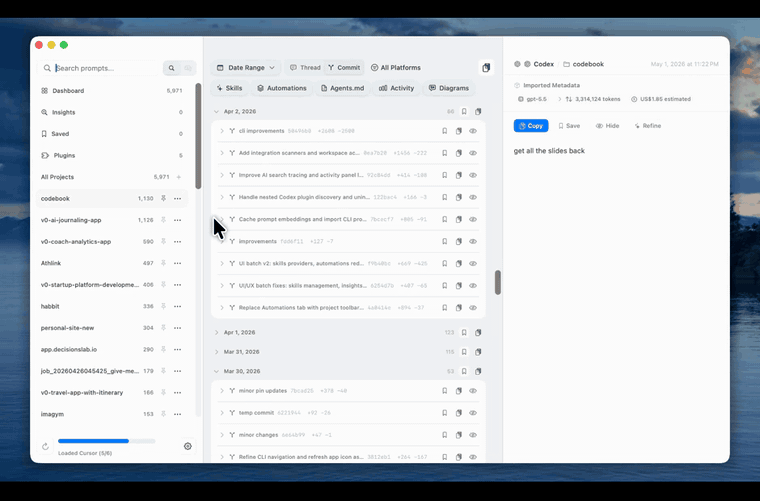
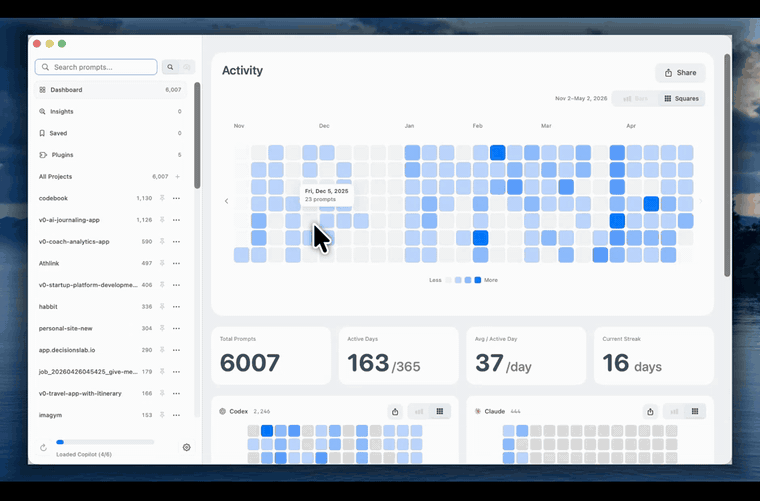
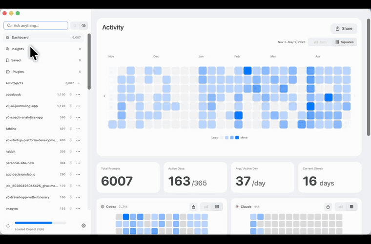
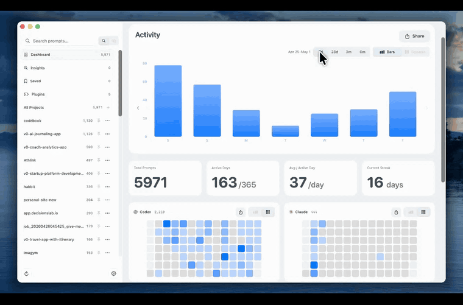
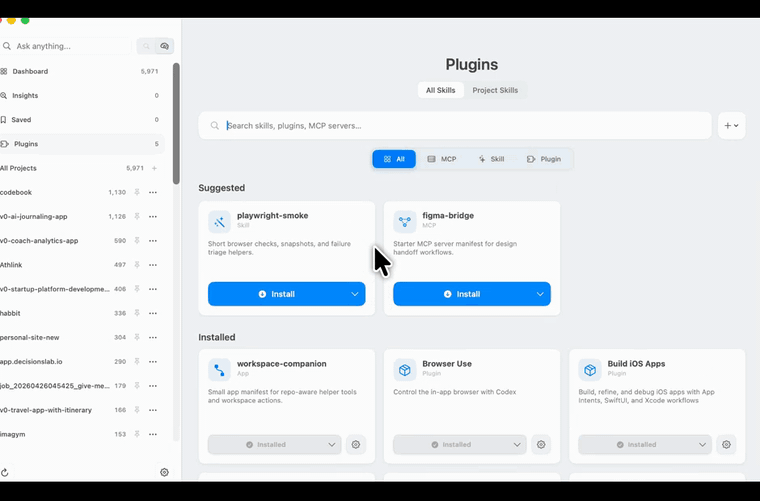
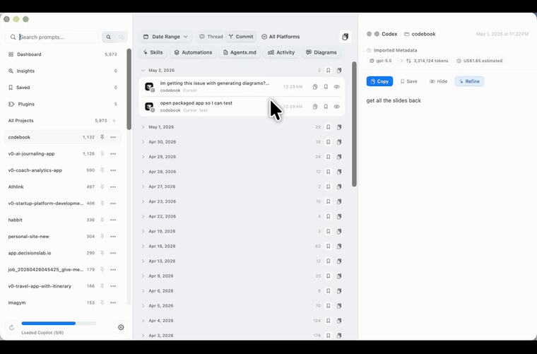
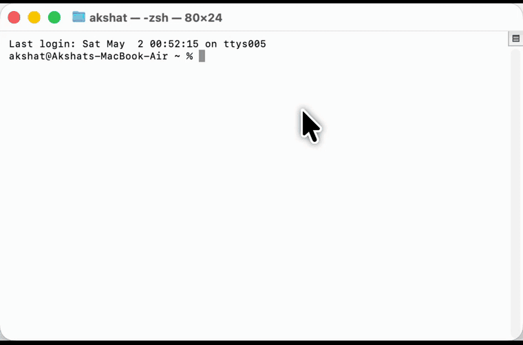
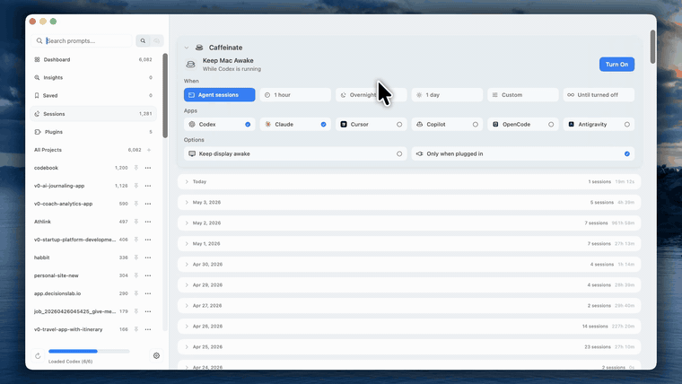
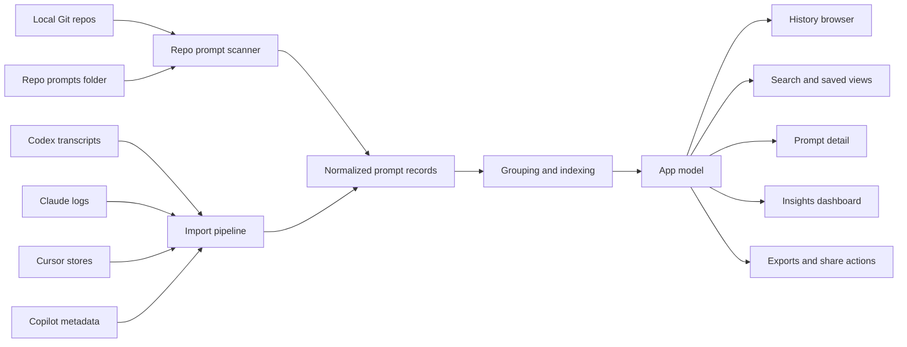
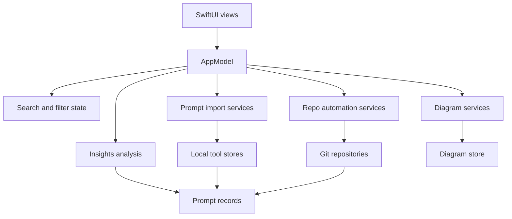

# Codebook

[](LICENSE)


Codebook is Git for prompts: a local-first macOS app for collecting, browsing, searching, saving, and sharing prompt history across local repos and AI coding tools.

[Download the latest macOS release](https://github.com/Akshat-Gup/codebook-app/releases/latest)

[Website](https://trycodebook.com/)

Codebook is open source under the [GNU Affero General Public License v3.0](LICENSE).

Copyright (C) 2026 Akshat Gupta.

SPDX-License-Identifier: `AGPL-3.0-only`

## Why Codebook Exists

AI coding has made pull requests harder to understand. The code diff shows what changed, but the prompt history often explains why it changed, what tradeoffs were considered, and which agent paths were abandoned.

Codebook gives that work a durable local library. It scans your local repos, prompt stores, and Git history, then organizes prompts by repo, provider, thread, date, and commit so they can be reviewed, reused, shared, and committed alongside the code they shaped.



## What Codebook Does

Codebook turns local prompt history into a browsable workspace:

- Scans local Git repos and treats each repo's `prompts/` folder as source-controlled prompt storage.
- Imports prompt history from supported tools such as Codex, Claude, Cursor, and GitHub Copilot.
- Normalizes prompts into a shared model with provider, repo, thread, date, commit, cost, and timing context where available.
- Groups prompt activity by repo, provider, thread, date, commit, and saved status.
- Provides a native SwiftUI browser for search, prompt detail, dashboards, diagrams, exports, skills, sessions, and automations.
- Keeps the workflow local-first and does not require a hosted account.

## Features

### Review Prompts By Commit Or Thread

Codebook groups prompts around the code they produced. Review prompts by commit when you want PR context, or by thread when you want the original agent conversation. Sharing and saving the relevant prompt set is one click.


### Search Your Prompt History

Use natural language search across old prompts, repos, and tools. Ask questions like "how did I implement auth last month" and jump back to the prompt that contains the answer.



### Understand Your Prompting Patterns

The dashboard shows local analytics for prompt volume, active days, provider usage, streaks, model patterns, costs, and timing. It is built for personal review without sending your prompt archive to a hosted dashboard.



### See Every Harness In One Place

Codebook gives you a cross-tool prompt dashboard for Codex, Claude, Cursor, and Copilot so your AI coding history is not split across hidden folders and separate app silos.



### Save And Export Useful Prompts

Star prompts you reuse, keep a local saved library, and export prompt sets for docs, handoff notes, or PR review. Saved prompts keep their repo and commit context.

### Schedule Local Automations

Create one-off or recurring prompt runs on your Mac, pause them when needed, and keep prompts local. Automations can target agent workflows, repo digests, exports, and backup routines.

### Install Agent Skills From GitHub

Search for skills and install them into Codex, Claude, and Cursor skill folders without manually copying files across hidden directories.



### Sync Agent Instructions And Prompt Folders

Codebook can create and sync a repo-level `prompts/` folder with Git hooks so prompt history can live next to source code. It also helps sync agent instruction files such as `AGENTS.md` and `CLAUDE.md`, then gives feedback on how to improve them.


### Generate Codebase Diagrams

Turn a repo or feature area into architecture diagrams: overview, components, data flow, dependencies, entry points, layers, and more. Diagrams can be regenerated as the code changes.



### Use The CLI

Codebook includes a CLI for terminal-first workflows and for agents that need granular access to prompt search, repo views, commits, saved prompts, activity, and automations.



### Keep Agents Running With Caffeinate

Codebook integrates with macOS `caffeinate` so your Mac can stay awake while Codex, Claude, Cursor, or Copilot are running. You can keep it awake by harness or for a specified duration.



## Feature Summary

- Native macOS SwiftUI interface.
- Local repo pinning and prompt-folder scanning.
- Local imports for supported AI coding tool histories.
- Thread, provider, repo, date, and commit-aware browsing.
- Natural language search and saved filter views.
- Prompt detail, copy, export, and sharing workflows.
- Scheduled prompts and recurring local automations.
- Insights views for activity, cost, timing, models, and provider usage.
- Diagram generation and storage for prompt-linked architecture notes.
- Agent skill search and one-click installation.
- `AGENTS.md`, `CLAUDE.md`, and `prompts/` sync workflows.
- CLI access for terminal and agent workflows.
- macOS `caffeinate` controls for long-running agent sessions.

## Platform

Codebook is macOS only.

- macOS 15 or later
- Swift 6.1 or later
- Xcode command line tools

Codebook is not built, tested, or supported for Windows or Linux.

## Build From Source

Clone the repo and build the Swift package:

```bash
git clone https://github.com/Akshat-Gup/codebook-app.git
cd codebook-app
swift build
```

## Verification

The public source mirror currently ships the app target only. Use `swift build` as the mirror verification command:

```bash
swift build
```

The upstream development workspace runs the fuller test suite before mirror updates are published.

## Architecture

### Local Data Flow



### App Layers



## Privacy

Codebook is local-first. It reads local repos and supported tool history from your machine, normalizes that information into local app state, and renders it in the desktop UI.

Codebook does not require a hosted account. If you enable features that call an external model or service, review the related provider settings and source code before using those features with sensitive repositories or prompt histories.

## Contact

- Email: [akshat@akshatgup.com](mailto:akshat@akshatgup.com)
- X: [@Akshat_Gup](https://x.com/Akshat_Gup)
- LinkedIn: [akshat-gup](https://www.linkedin.com/in/akshat-gup/)
- GitHub: [Akshat-Gup](https://github.com/Akshat-Gup/)

## License

Copyright (C) 2026 Akshat Gupta.

Codebook is licensed under the [GNU Affero General Public License v3.0](LICENSE), SPDX identifier `AGPL-3.0-only`.

In practical terms:

- You may use, study, modify, and distribute Codebook under the AGPLv3.
- Commercial use is allowed under the AGPLv3.
- If you distribute a modified version, you must provide the corresponding source under the AGPLv3.
- If you run a modified version as a network service, users interacting with it over the network must be offered the corresponding source.
- Codebook is provided without warranty.

This summary is not legal advice. The full license text controls.

## Contributing

Contributions are welcome under the AGPLv3.

Before opening a pull request:

- Keep changes focused and consistent with the surrounding SwiftUI and service patterns.
- Avoid committing local prompt archives, private logs, signing assets, or generated release artifacts.
- Run `swift build` before submitting app-source changes.
