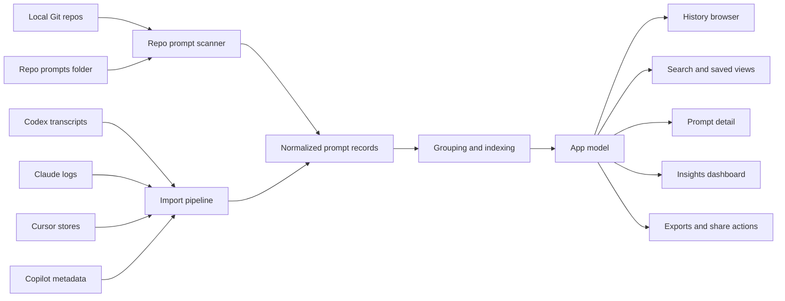
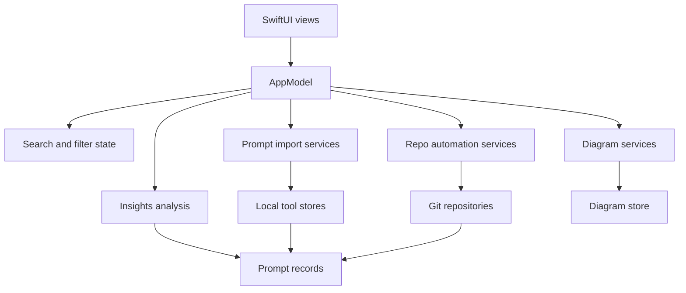
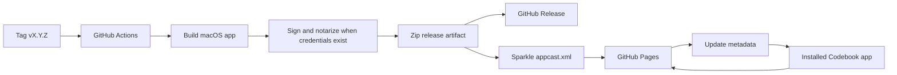

# Codebook

[](LICENSE)


Codebook is a local-first macOS app for collecting, browsing, searching, and sharing prompt history across local repos and supported AI coding tools.

Codebook is open source under the [GNU Affero General Public License v3.0](LICENSE).

SPDX-License-Identifier: `AGPL-3.0-only`

## Media

Add screen recordings and screenshots here as the public release gets polished:

https://github.com/user-attachments/assets/codebook-overview-placeholder

| View | Placeholder |
|---|---|
| Overview recording | `docs/media/codebook-overview.mp4` |
| History browser | `docs/media/history-browser.png` |
| Insights dashboard | `docs/media/insights-dashboard.png` |
| Search and detail | `docs/media/search-and-detail.png` |

## What Codebook Does

Codebook turns local prompt history into a browsable workspace:

- Pins local Git repos and treats each repo's `prompts/` folder as source-controlled prompt storage.
- Imports prompt history from supported local tools such as Codex, Claude, Cursor, and GitHub Copilot.
- Normalizes prompts into a shared model with provider, repo, thread, date, commit, cost, and timing context where available.
- Groups prompt activity by repo, provider, thread, date, and commit bucket.
- Provides a native SwiftUI browser for search, saved views, prompt detail, dashboards, diagrams, and exports.
- Keeps the workflow local-first and does not require a hosted account.

## Why It Exists

AI coding work creates useful context that is easy to lose: prompts, generated plans, debugging sessions, review notes, and decisions that explain why a repo changed. Codebook gives that work a durable local library so it can be searched, reused, shared, and committed alongside the projects it belongs to.

## Features

- Native macOS SwiftUI interface.
- Local repo pinning and prompt-folder scanning.
- Local imports for supported AI coding tool histories.
- Thread, provider, repo, date, and commit-aware browsing.
- Search and saved filter views.
- Prompt detail, copy, export, and sharing workflows.
- Insights views for activity, cost, timing, models, and provider usage.
- Diagram generation and storage for prompt-linked architecture notes.
- Sparkle-based update support for packaged builds.

## Platform

Codebook is macOS only.

- macOS 15 or later
- Swift 6.1 or later
- Xcode command line tools

Codebook is not built, tested, or supported for Windows or Linux.

## Install

Download packaged builds from the public releases page when releases are available:

```text
https://github.com/Akshat-Gup/codebook-app/releases
```

Unsigned builds may require the normal macOS Gatekeeper bypass flow. Signed and notarized builds are preferred for broader distribution.

## Build From Source

Clone the repo and build the Swift package:

```bash
git clone https://github.com/Akshat-Gup/codebook-app.git
cd codebook-app
swift build
```

For a packaged `.app` bundle:

```bash
./scripts/package_codebook_app.sh
open dist/Codebook.app
```

## Run Tests

The public source mirror currently ships the app target only. Use `swift build` as the mirror verification command:

```bash
swift build
```

The upstream development workspace runs the fuller test suite before mirror updates are published.

## Architecture

### Local Data Flow



### App Layers



### Release And Updates



## Privacy

Codebook is local-first. It reads local repos and supported tool history from your machine, normalizes that information into local app state, and renders it in the desktop UI.

Codebook does not require a hosted account. If you enable features that call an external model or service, review the related provider settings and source code before using those features with sensitive repositories or prompt histories.

## License

Codebook is licensed under the [GNU Affero General Public License v3.0](LICENSE), SPDX identifier `AGPL-3.0-only`.

In practical terms:

- You may use, study, modify, and distribute Codebook under the AGPLv3.
- Commercial use is allowed under the AGPLv3.
- If you distribute a modified version, you must provide the corresponding source under the AGPLv3.
- If you run a modified version as a network service, users interacting with it over the network must be offered the corresponding source.
- Codebook is provided without warranty.

This summary is not legal advice. The full license text controls.

## Contributing

Contributions are welcome under the AGPLv3.

Before opening a pull request:

- Keep changes focused and consistent with the surrounding SwiftUI and service patterns.
- Avoid committing local prompt archives, private logs, signing assets, or generated release artifacts.
- Run the smallest verification command that proves the change, usually `swift test`.
- Include screenshots or screen recordings for meaningful UI changes.

## Status

Codebook is early macOS software. The public source mirror is intended to make the app inspectable, forkable, and buildable while the product surface continues to evolve.
